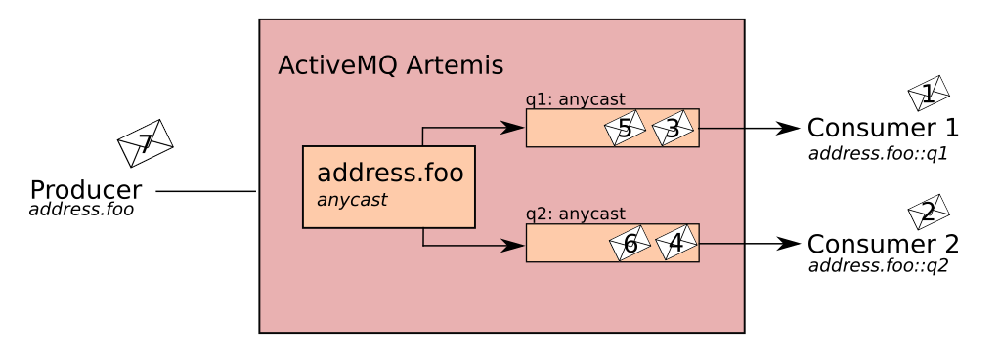
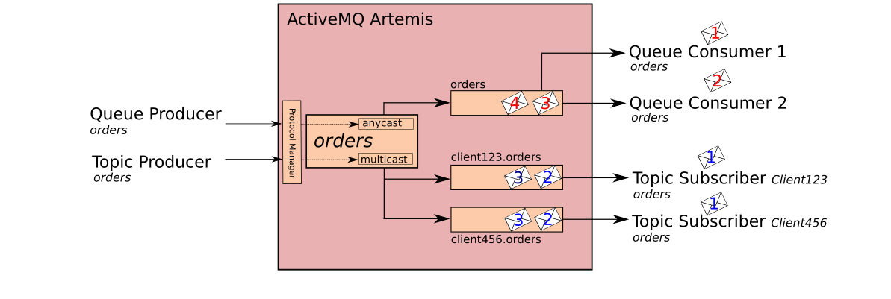

# Apache ActiveMQ Artemis Addressing and Queues

Apache ActiveMQ Artemis has a unique addressing model that is both powerful and flexible and that offers great performance. The addressing model comprises three main concepts: addresses, queues and routing types.

An address represents a messaging endpoint. Within the configuration, a typical address is given a unique name, 0 or more queues, and a routing type.

A queue is associated with an address. There can be multiple queues per address. Once an incoming message is matched to an address, the message will be sent on to one or more of its queues, depending on the routing type configured. Queues can be configured to be automatically created and deleted.

A routing type determines how messages are sent to the queues associated with an address. A Apache ActiveMQ Artemis address can be configured with two different routing types.

Table 1. Routing Types

| If you want your messages routed to…​	                                   | Use this routing type …​ |
| :----------------------------------------------------------------------: | :---------------------: |
| A single queue within the matching address, in a point-to-point manner.  | Anycast                 |
| Every queue within the matching address, in a publish-subscribe manner.  | Multicast               |

--------------------------------------------------------------------------------------------
**Note:** It is possible to define more than one routing type per address, but this typically results in an anti-pattern and is therefore not recommended.  If an address does use both routing types, however, and the client does not show a preference for either one, the broker typically defaults to the anycast routing type.
The one exception is when the client uses the MQTT protocol. In that case, the default routing type is multicast. |

## Background (Protocol Managers and Addresses)

A protocol manager maps protocol specific concepts down to the Apache ActiveMQ Artemis core model of addresses, queues and routing types. For example, when a client sends a MQTT subscription packet with the addresses 

```
/house/room1/lights
/house/room2/lights
```

The MQTT protocol manager understands that the two addresses require multicast semantics. The protocol manager will therefore first look to ensure that multicast is enabled for both addresses. If not, it will attempt to dynamically create them. If successful, the protocol manager will then create special subscription queues with special names, for each subscription requested by the client.

The special name allows the protocol manager to quickly identify the required client subscription queues should the client disconnect and reconnect at a later date.  If the subscription is temporary the protocol manager will delete the queue once the client disconnects.

If a client requests a point to point semantic (e.g. JMS Queue).  Apache ActiveMQ Artemis will first look at the address sent by the client and use that to look up an Apache ActiveMQ Artemis address.  It will then ensure the point to point (Anycast) routing type is enabled. 

If it is it will aim to locate a queue with the same name as the address. If it does not exist, it will look for the first queue available. If this does not exist then it will auto create the queue (providing auto create is enabled) and then bind the consumer to this queue.

N.B. If the queue is auto created, it will be auto deleted once there are no consumers and no messages in it.  For more information on auto create see 

## Basic Address Configuration

The following examples show how to configure basic point to point and publish subscribe addresses.

### Point-to-Point Messaging

Point-to-point messaging is a common scenario in which a message sent by a producer has only one consumer. AMQP and JMS message producers and consumers can make use of point-to-point messaging queues, for example. Define an anycast routing type for an address so that its queues receive messages in a point-to-point manner.

When a message is received on an address using anycast, Apache ActiveMQ Artemis locates the queue associated with the address and routes the message to it. When consumers request to consume from the address, the broker locates the relevant queue and associates this queue with the appropriate consumers. If multiple consumers are connected to the same queue, messages are distributed amongst each consumer equally, providing the consumers are equally able to handle them.


Figure 1. Point to Point Messaging

#### Configuring an Address to Use the Anycast Routing Type

Open the file <broker-instance>/etc/broker.xml for editing.

Add an address configuration element and its associated queue if they do not exist already.

```xml
<configuration ...>
  <core ...>
    ...
    <address name="address.foo">
      <anycast>
        <queue name="q1"/>
      </anycast>
    </address>
  </core>
</configuration>
```

### Publish-Subscribe Messaging

In a publish-subscribe scenario, messages are sent to every consumer subscribed to an address. JMS topics and MQTT subscriptions are two examples of publish-subscribe messaging. An example of a publish-subscribe Assign a multicast routing type for an address so that its queues receive messages in a pubish-subscribe manner.

When a message is received on an address with a multicast routing type, Apache ActiveMQ Artemis will route a copy of the message (in reality only a message reference to reduce the overhead of copying) to each queue.


Figure 2. Publish-Subscribe

#### Configuring an Address to Use the Multicast Routing Type

Open the file <broker-instance>/etc/broker.xml for editing.

Add an address configuration element with multicast routing type.

```xml
<configuration ...>
  <core ...>
    ...
    <address name="topic.foo">
      <multicast/>
    </address>
  </core>
</configuration>
```

(Optional) Add one more queue elements to the address and wrap the multicast element around them. This step is typically not needed since the broker will automatically create a queue for each subscription requested by a client.

```xml
<configuration ...>
  <core ...>
    ...
    <address name="topic.foo">
      <multicast>
        <queue name="client123.topic.foo"/>
        <queue name="client456.topic.foo"/>
      </multicast>
    </address>
  </core>
</configration>
```

Figure 3. Point-to-Point with Two Queues

### Point-to-Point Address multiple Queues

It is actually possible to define more than one queue on an address with an anycast routing type. When messages are received on such an address, they are firstly distributed evenly across all the defined queues. Using Fully Qualified Queue Names described later, clients are able to select the queue that they’d like to subscribe to. Should more than one consumer connect direct to a single queue, Apache ActiveMQ Artemis will take care of distributing messages between them, as in the example above.


Figure 3. Point-to-Point with Two Queues

--------------------------------------------------------------------------------------------
**Note:** This is how Apache ActiveMQ Artemis handles load balancing of queues across multiple nodes in a cluster.
Configuring a Point-to-Point Address with Two Queues
Open the file <broker-instance>/etc/broker.xml for editing.

Add an address configuration with Anycast routing type element and its associated queues.

```xml
<configuration ...>
  <core ...>
    ...
    <address name="address.foo">
      <anycast>
        <queue name="q1"/>
        <queue name="q2"/>
      </anycast>
    </address>
  </core>
</configuration>
```

### Point-to-Point and Publish-Subscribe Addresses

It is possible to define an address with both point-to-point and publish-subscribe semantics enabled. While not typically recommend, this can be useful when you want, for example, a JMS Queue say orders and a JMS Topic named orders. The different routing types make the addresses appear to be distinct.

Using an example of JMS Clients, the messages sent by a JMS queue producer will be routed using the anycast routing type. Messages sent by a JMS topic producer will use the multicast routing type. In addition when a JMS topic consumer attaches it will be attached to it’s own subscription queue. JMS queue consumer will be attached to the anycast queue.


Figure 4. [Point-to-Point and Publish-Subscribe

--------------------------------------------------------------------------------------------
**Note:** The behavior in this scenario is dependent on the protocol being used. For JMS there is a clear distinction between topic and queue producers and consumers, which make the logic straight forward. Other protocols like AMQP do not make this distinction. A message being sent via AMQP will be routed by both anycast and multicast and consumers will default to anycast. For more information, please check the behavior of each protocol in the sections on protocols.

The XML snippet below is an example of what the configuration for an address using both anycast and multicast would look like in <broker-instance>/etc/broker.xml. routing types. Note that subscription queues are typically created on demand, so there is no need to list specific queue elements inside the multicast routing type.

```xml
<configuration ...>
  <core ...>
    ...
    <address name="foo.orders">
      <anycast>
        <queue name="orders"/>
      </anycast>
      <multicast/>
    </address>
  </core>
</configuration>
```

## How to filter messages

Apache ActiveMQ Artemis supports the ability to filter messages using Apache Artemis [Filter Expressions](#filter-expressions).

Filters can be applied in two places, on a queue and on a consumer.

### Queue Filter

When a filter is applied to a queue, messages are filter before they sent to the queue.  To add a queue filter use the
filter element when configuring a queue.  Open up the broker.xml and add an address with a queue, using the filter element
to configure a filter on this queue.

```xml
    <address name="filter">
       <queue name=filter">
          <filter string="color='red'"/>
        </queue>
    </address>
```

The filter defined above ensures that only messages with an attribute "color='red'" is sent to this queue.

### Consumer Filters

Consumer filters are applied after messages have reached a queue and are defined using the appropriate client APIs.  The
follow JMS example shows how to consumer filters work.

1. Define an address with a single queue, with no filter applied.

```xml
    <address name="filter">
       <queue name=filter">
          <filter string="color='red'"/>
        </queue>
    </address>
```

```java
  ...
  // Send some messages
  for (int i = 0; i < 3; i ++) {
    TextMessage redMessage = senderSession.createTextMessage("Red");
    redMessage.setStringProperty("color", "red");
    producer.send(redMessage)
        
   TextMessage greenMessage = senderSession.createTextMessage("Green");
   greenMessage.setStringProperty("color", "green");
   producer.send(greenMessage)
  }
```

At this point the queue would have 6 messages: red,green,red,green,red,green
         
```java
  MessageConsumer redConsumer = redSession.createConsumer(queue, "color='red'");
```

The redConsumer has a filter that only matches "red" messages.  The redConsumer will receive 3 messages.

```
red, red, red
```

The resulting queue would now be

```
green, green, green
```

## Creating and Deleting Addresses and Queues Automatically

You can configure Apache ActiveMQ Artemis  to automatically create addresses and then delete them when they are no longer in use. This saves you from having to preconfigure each address before a client can connect to it. Automatic creation and deletion is configured on a per address basis and is controlled by following

| Parameter | Description |
---------------------------
| auto-create-addresses | When set to true, the broker will create the address requested by the client if it does not exist already. The default is true.|
| auto-delete-addresses | When set to true, the broker will be delete the address once all of it’s queues have been deleted. The default is true |
|default-address-routing-type | The routing type to use if the client does not specify one. Possible values are MULTICAST and ANYCAST. See earlier in this chapter for more information about routing types. The default value is MULTICAST. |

Configuring an Address to be Automatically Created

Edit the file <broker-instance>/etc/broker.xml and add the auto-create-addresses element to the address-setting you want the broker to automatically create.

(Optional) Add the address-setting if it does not exits. Use the match parameter and the The Apache ActiveMQ Artemis Wildcard Syntax to match more than one specific address.

Set auto-create-addresses to true

(Optional) Assign MULTICAST or ANYCAST as the default routing type for the address.

The example below configures an address-setting to be automatically created by the broker. The default routing type to be used if not specified by the client is MULTICAST. Note that wildcard syntax is used. Any address starting with /news/politics/ will be automatically created by the broker.

```xml
<configuration ...>
  <core ...>
    ...
    <address-settings>
       <address-setting match="/news/politics/#">
          <auto-create-addresses>true</auto-create-addresses>
          <default-address-routing-type>MULTICAST</default-address-routing-type>
       </address-setting>
    </address-settings>
    ...
  </core>
</configuration>
```

Configuring and Address to be Automatically Deleted
Edit the file <broker-instance>/etc/broker.xml and add the auto-delete-addresses element to the address-setting you want the broker to automatically create.

(Optional) Add the address-setting if it does not exits. Use the match parameter and the The Apache ActiveMQ Artemis Wildcard Syntax to match more than one specific address.

Set auto-delete-addresses to true

The example below configures an address-setting to be automatically deleted by the broker. Note that wildcard syntax is used. Any address request by the client that starts with /news/politics/ is configured to be automatically deleted by the broker.

```xml
<configuration ...>
  <core ...>
    ...
    <address-settings>
       <address-setting match="/news/politics/#">
          <auto-create-addresses>true</auto-create-addresses>
          <default-address-routing-type>MULTICAST</default-address-routing-type>
       </address-setting>
    </address-settings>
    ...
  </core>
</configuration>
```

## Fully Qualified Queue Names

Internally the broker maps a client’s request for an address to specific queues. The broker decides on behalf of the client which queues to send messages to or from which queue to receive messages. However, more advanced use cases might require that the client specify a queue directly. In these situations the client and use a fully qualified queue name, by specifying both the address name and the queue name, separated by a ::.

### Specifying a Fully Qualified Queue Name
In this example, the address foo is configured with two queues q1, q2 as shown in the configuration below.

```xml
<configuration ...>
  <core ...>
    ...
    <addresses>
       <address name="foo">
          <anycast>
             <queue name="q1" />
             <queue name="q2" />
          </anycast>
       </address>
    </addresses>
  </core>
</configuration>
```

In the client code, use both the address name and the queue name when requesting a connection from the broker. Remember to use two colons, ::, to separate the names, as in the example Java code below.

```java
String FQQN = "foo::q1";
Queue q1 session.createQueue(FQQN);
MessageConsumer consumer = session.createConsumer(q1);
```

## Configuring a Prefix to Connect to a Specific Routing Type

Normally, if a Apache ActiveMQ Artemis receivs a message sent to a particular address, that has both anycast and multicast routing types enable, Apache ActiveMQ Artemis will route a copy of the message to **one** of the anycast queues and to **all** of the multicast queues.

However, clients can specify a special prefix when connecting to an address to specify whether to connect using anycast or multicast. The prefixes are custom values that are designated using the anycastPrefix and multicastPrefix parameters within the URL of an acceptor.

### Configuring an Anycast Prefix

In <broker-instance>/etc/broker.xml, add the anycastPrefix to the URL of the desired acceptor. In the example below, the acceptor is configured to use anycast:// for the anycastPrefix. Client code can specify anycast://foo/ if the client needs to send a message to only one of the anycast queues.

```xml
<configuration ...>
  <core ...>
    ...
      <acceptors>
         <acceptor name="artemis">tcp://0.0.0.0:61616?protocols=AMQP&anycastPrefix=anycast://</acceptor>
      </acceptors>
    ...
  </core>
</configuration>
```

### Configuring a Multicast Prefix

In <broker-instance>/etc/broker.xml, add the anycastPrefix to the URL of the desired acceptor. In the example below, the acceptor is configured to use multicast:// for the multicastPrefix. Client code can specify multicast://foo/ if the client needs the message sent to only the multicast queues of the address.

```xml
<configuration ...>
  <core ...>
    ...
      <acceptors>
         <acceptor name="artemis">tcp://0.0.0.0:61616?protocols=AMQP&multicastPrefix=multicast://</acceptor>
      </acceptors>
    ...
  </core>
</configuration>
```

## Advanced Address Configuration

### Pre-configuring subscription queue semantics

In most cases it’s not necessary to pre-create subscription queues. The relevant protocol managers take care of creating subscription queues when clients request to subscribe to an address.  The type of subscription queue created, depends on what properties the client request.  E.g. durable, non-shared, shared etc...  Protocol managers uses special queue names to identify which queues below to which consumers and users need not worry about the details.

However, there are scenarios where a user may want to use broker side configuration to pre-configure a subscription.  And later connect to that queue directly using an FQQN.  The examples below show how to use broker side configuration to pre-configure a queue with publish subscribe behavior for shared, non-shared, durable and non-durable subscription behavior.

#### Configuring a shared durable subscription queue with up to 10 concurrent consumers

The default behavior for queues is to not limit the number connected queue consumers.  The **max-consumers** paramter of the queue element can be used to limit the number of connected consumers allowed at any one time.

Open the file <broker-instance>/etc/broker.xml for editing.

```xml
<configuration ...>
  <core ...>
    ...
    <address name="durable.foo">
      <multicast>
        <!-- pre-configured shared durable subscription queue -->
        <queue name="q1" max-consumers="10">
          <durable>true</durable>
        </queue>
      </multicast>
    </address>
  </core>
</configuration>
```

#### Configuring a non-shared durable subscription

The broker can be configured to prevent more than one consumer from connecting to a queue at any one time. The subscriptions to queues configured this way are therefore "non-shared".  To do this simply set the **max-consumers** parameter to "1"

```xml
<configuration ...>
  <core ...>
    ...
    <address name="durable.foo">
      <multicast>
        <!-- pre-configured non shared durable subscription queue -->
        <queue name="q1" max-consumers="1">
          <durable>true</durable>
        </queue>
      </multicast>
    </address>
  </core>
</configuration>
```

#### Pre-configuring a queue as a non-durable subscription queue

Non-durable subscriptions are again usually managed by the relevant protocol manager, by creating and deleting temporary queues.

If a user requires to pre-create a queue that behaves like a non-durable subscription queue the **purge-on-no-consumers** flag can be enabled on the queue.  When **purge-on-no-consumers** is set to **true**.  The queue will not start receiving messages until a consumer is attached.  When the last consumer is detached from the queue.  The queue is purged (it's messages are removed) and will not receive any more messages until a new consumer is attached.

Open the file <broker-instance>/etc/broker.xml for editing.

```xml
<configuration ...>
  <core ...>
    ...
    <address name="non.shared.durable.foo">
      <multicast>
        <queue name="orders1" purge-on-no-consumers="true"/>
      </multicast>
    </address>
  </core>
</configuration>
```