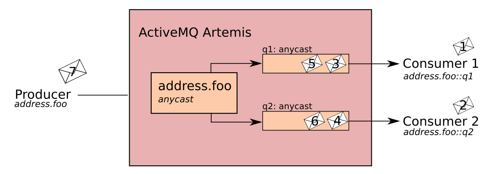

# ActiveMQ Artemis Address Model

ActiveMQ Artemis has a unique addressing model that is both powerful and flexible and which offers great performance.  The ActiveMQ Artemis Addressing model deals with three main concepts.  Addresses, Queues and Routing Types.

Addresses represent endpoints to which messages are sent.  Each address has a name, a set of supported routing types and can have 0 or more queues associated with it.  Messages received by the broker are matched against an address’s name, if it is matched, the message is routed to 1 or more of the addresses queues.  How the message is routed to the queues is dependent on the queue's routing type.  

There are two flavours of routing type:

* Anycast: The message will be routed to a single queue within the matching address.
* Multicast: The message will be routed every queue within the matching address.

Anycast and Multicast are used to define point to point and publish, subscribe semantics on an address.  There are two places routing types exist.  Firstly, a queue has a single routing type which defines how it requires messages to be routed to it.  Secondly, the address itself contains a set of routing types which define which routing semantics are supported by this address.  

N.B. Although it’s possible to define more than one routing type per address, this is an anti-pattern and is not recommended.  It is required for some JMS edge cases that we’ll discuss later.

The following examples show how to define various address semantics using the ActiveMQ Artemis Addressing model.  All example are in XML and appear as they would in the broker configuration file.

## Address Configuration

### Point to Point
The following example defines an address named "address.foo" with support for anycast message routing.  The address has a single queue called "q1".

```XML
<address name="address.foo">
  <anycast>
    <queue name="q1"/>
  </anycast>
</address>
```

When a message is receieved on "address.foo".  ActiveMQ Artemis will locate the queue assocated with the address, in this case "q1", and route the messages to it.  When consumers request to consume from "address.foo" it will locate the relevant queue and associate this queue with the appropriate consumers.  If multiple consumers are connected to the same queue, messages are distributed amongst each consumer equally (providing the consumers are equally able to handle them).

N.B. It is possible to auto create addresses and queues on demand.  To do this please read the section on Auto Creation.


### Point to Point 2 queues
The following XML snippet shows how to define an anycast address with two queues defined using the ActiveMQ Artemis broker configuration.

```XML
<address name="address">
  <anycast>
    <queue name="q1"/>
    <queue name="q2"/>
  </anycast>
</address>
```

It is actually possible to define more than one queue on an address with an Anycast routing type.  When messages are received on such an address, they are firstly distributed evenly across all the defined queues.  Using Fully Qualified Queue Names described later, clients are able to select the queue that they'd like to subscribe to.  Should more than one consumer connect direct to a single queue, ActiveMQ Artemis will take care of distributing messages between them, as in the example above.



N.B. This is how ActiveMQ Artemis handles load balancing of queues across multiple nodes in a cluster.

## Publish Subscribe
The following XML snippet shows how to define a publish subscribe address with a two queues using the ActiveMQ Artemis broker configuration.

```XML
<address name="topic.foo">
  <multicast>
    <queue name="client123.topic.foo"/>
    <queue name="client456.topic.foo"/>
  </multicast>
</address>
```

When a message is received on "topic.foo" ActiveMQ Artemis will route a copy of the message (in reality only a message reference to reduce the overhead of copying) to each queue.


N.B. In most cases it's not necessary to pre-create subscription queues.  The relevant protocol manager will take care of creating the subscription queues when the client initially requests to subscribe to an address.  For durable subscriptions, the generated queue name is usually a concatination of the client id and the address.

## Point to Point and Publish Subscribe
As mention earlier it is possible to define an address with both Point to Point and Publish Subscribe semantics enabled.  This can be useful when you want, for example, a JMS Queue say "orders" and a JMS Topic named "orders".  The different routing types make the addresses appear to be distinct.

The XML snippet below shows how this would be defined in the broker XML configuration.  (Note that again we have explicitly defined all subscription queues for illustration purposes, these will usually be created on demand and as such this is not required)

```XML
<address name="foo">
  <anycast>
    <queue name="foo"/>
  </anycast>
  <multicast>
    <queue name="client123.orders" />
    <queue name="client456.orders" />
  </multicast>
</address>
```

Using an example of JMS Clients, the messages sent by a JMS queue producer will be routed using the anycast routing type.  Messages sent by a JMS topic producer will use the multicast routing type.  In addition when a JMS topic consumer attaches it will be attached to it's own subscription queue. JMS queue consumer will be attached to the anycast queue.


N.B. It is worth pointing out that the behaviour in this scenario is dependent on the protocol being used.  For JMS there is a clear distinction between topic and queue producers and consumers, which make the logic straight forward.  Other protocols like AMQP do not make this distinction.  A message being sent via AMQP will be routed by both anycast and multicast and consumers will default to anycast.  For more information, please check the behaviour of each protocol in the sections on protocols.

### Protocol Managers and Addressing Objects

There are a couple of ways in which addresses and queues are created with in ActiveMQ Artemis.  Firstly, each protocol manager maps protocol specific concepts down to the ActiveMQ Artemis core model of addresses, queues and routing types.  

In MQTT for example, when subscription packet is received with two addresses say "/house/room1/lights" and "/house/room2/lights", the MQTT protocol manager understands that it requires 2 addresses with multicast semantics.  

It will first look for the addresses to ensure that multicast is enabled on these addresses.  If not, it will attempt to dynamically create them (providing auto-create-addresses is enabled, more on this later) and once each address is found/created the protocol manager goes ahead and creates a special subscription queues for each subscription this client has requested.  

The equivilent broker xml configuration for what has just been created would look like the following:

```XML

<!-- Note that the path separator in the addresses have been changed to use the default core characters.  This is configurable -->
<address name="house.room1.lights">
  <multicast>
    <queue name="client123.house.room1.lights" />
  </multicast>
</address>

<address name="house.room2.lights">
  <multicast>
    <queue name="client123.house.room2.lights" />
  </multicast>
</address>
```

Each protocol behaves slightly differently.  The sections below describe what typically happens when subscribe frames to various endpoints are request.

#### Durable Subscription
The protocol manager looks for the appropriate address and ensures that multicast semantics is enabled.  It then creates a special subscpiption queue with the clientid and the address as it's name and multicast as it's routing type.  The special name allows the protocol manager to quickly identify the required client subscription queues should the client disconnect and reconnnect at a later date.  

When the client unsubscribes the queue is deleted.

#### Temporary Subscription
Protocol manager looks for the appropriate address and ensures that multicast semantics is enabled.  It then creates a queue with a random (read UUID) name under this address with multicast routing type.  

When the client disconnects the queue is deleted.

#### Point to Point or JMS Queue
Protocol manager looks for the appropirate address and ensures that anycast routing type is enabled.  If it is it will aim to locate a queue with the same name as the address.  If it does not exist, it will look for the first queue available.  It this does not exist then it will auto create the queue (providing auto create is enabled).  The queue consumer is bound to this queue.

If the queue is auto created, it will be auto deleted once there are no consumers and no messages in it.

## Explicit broker side configuration
We've already seen some examples of explicit broker side configuration.  The ActiveMQ Artemis addressing model allows fine grain control over exactly what is created through the use of security settings (see the section on security settings here) and also by allowing specific creation of all types of endpoints.  

### Point to Point
This example specifies an address called "orders" that supports anycast routing.  A single queue with the same name is defined and is durable.

```XML
<address name="orders">
  <anycast>
    <queue name="orders">
      <durable>true</durable>
    </queue>
  </anycast>
</address>
```

### Non Shared Durable Subscription

```XML
<address name="orders">
  <multicast>
    <queue name="orders1" maxConsumers=1>
      <durable>true</durable>
    </queue>
    <queue name="orders2" maxConsumers=1>
      <durable>true</durable>
    </queue>
  </mutlicast>
</address>
```

This example specifies an address called "orders" that supports multicast routing.  Two non shared subscription queues have been created.  Note the max consumers setting on each queue.  This explicitly prevents more than one consumer connection to this queue at any one time.  Hence it's "non-shared".

N.B. You may remember earlier in this chapter that subscription queues are usually created by protocol managers and are named <client-id>.<subscription-name>.  So how then do consumers connect direct to a subscription queue.  We'll get to this later under the sections "Fully Qualified Queue Names" and "Aliasing".

## Auto Create Settings

So far we've looked at examples that explicitly define addresses, routing types and queues.  It's also possible to have many of these settings
